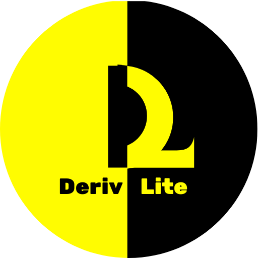

# 🤖 Deriv Trading Bot Builder - TICKSHARK

Create automated trading strategies without coding! Build powerful Deriv trading bots with our visual block-based interface.



## ✨ Features

- **🎯 Visual Bot Builder**: Drag-and-drop interface using Blockly
- **📊 Quick Strategy Templates**: Pre-built strategies like Martingale, D'Alembert, Oscar's Grind
- **📈 Real-time Charts**: Integrated TradingView charts
- **🔄 Backtesting**: Test your strategies before going live
- **📱 Mobile Responsive**: Works on all devices
- **🎨 Multiple Themes**: Light and dark mode support
- **🌐 Multi-language**: Support for multiple languages
- **📊 Analytics Tools**: Built-in analysis and signals
- **🤖 Free Bot Collection**: Access to pre-made trading bots

## 🚀 Live Demo

Visit the live application: [Your Deployed URL Here]

## 🛠️ Tech Stack

- **Frontend**: React 18, TypeScript
- **Build Tool**: RSBuild
- **Styling**: SCSS, CSS Modules
- **State Management**: MobX
- **Charts**: Deriv Charts, TradingView
- **Block Editor**: Blockly (Google)
- **Testing**: Jest, React Testing Library
- **Deployment**: Netlify

## 📦 Installation

1. **Clone the repository**
   ```bash
   git clone https://github.com/yourusername/deriv-bot-builder.git
   cd deriv-bot-builder
   ```

2. **Install dependencies**
   ```bash
   npm install
   ```

3. **Start development server**
   ```bash
   npm start
   ```

4. **Build for production**
   ```bash
   npm run build
   ```

## 🎮 Usage

1. **Dashboard**: Start by exploring the dashboard with quick strategy templates
2. **Bot Builder**: Use the visual editor to create custom trading strategies
3. **Quick Strategy**: Choose from pre-built strategies and customize parameters
4. **Analysis**: Access trading analysis tools and signals
5. **Run Bot**: Deploy your bot and monitor performance

## 📁 Project Structure

```
src/
├── components/          # Reusable UI components
├── pages/              # Page components
├── stores/             # MobX state management
├── utils/              # Utility functions
├── external/           # External libraries (bot-skeleton)
├── hooks/              # Custom React hooks
├── types/              # TypeScript type definitions
└── styles/             # Global styles
```

## 🔧 Available Scripts

- `npm start` - Start development server
- `npm run build` - Build for production
- `npm test` - Run tests
- `npm run test:lint` - Run linting
- `npm run serve` - Serve built files

## 🌟 Key Features

### Visual Bot Builder
- Drag-and-drop block interface
- Real-time code generation
- Strategy validation
- Export/import functionality

### Quick Strategies
- **Martingale**: Classic progression strategy
- **D'Alembert**: Balanced risk approach
- **Oscar's Grind**: Conservative profit targeting
- **Reverse Martingale**: Anti-martingale system
- **Accumulator Strategies**: For accumulator contracts

### Analysis Tools
- Market analysis dashboard
- Trading signals
- Performance metrics
- Risk management tools

## 🤝 Contributing

1. Fork the repository
2. Create your feature branch (`git checkout -b feature/AmazingFeature`)
3. Commit your changes (`git commit -m 'Add some AmazingFeature'`)
4. Push to the branch (`git push origin feature/AmazingFeature`)
5. Open a Pull Request

## 📄 License

This project is licensed under the MIT License - see the [LICENSE](LICENSE) file for details.

## 🙏 Acknowledgments

- [Deriv](https://deriv.com) for the trading platform
- [Blockly](https://developers.google.com/blockly) for the visual editor
- [React](https://reactjs.org/) for the UI framework
- [TradingView](https://www.tradingview.com/) for charting

## 📞 Support

For support and questions:
- 📧 Email: support@tickshark.com
- 🌐 Website: [tickshark.com](https://tickshark.com)
- 💬 Live Chat: Available on the website

---

**⚠️ Disclaimer**: Trading involves risk. Past performance is not indicative of future results. Please trade responsibly.
